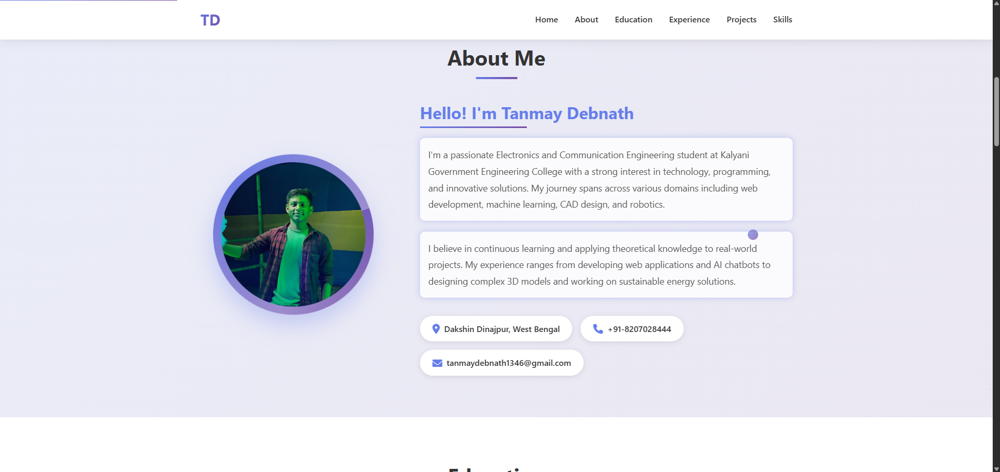
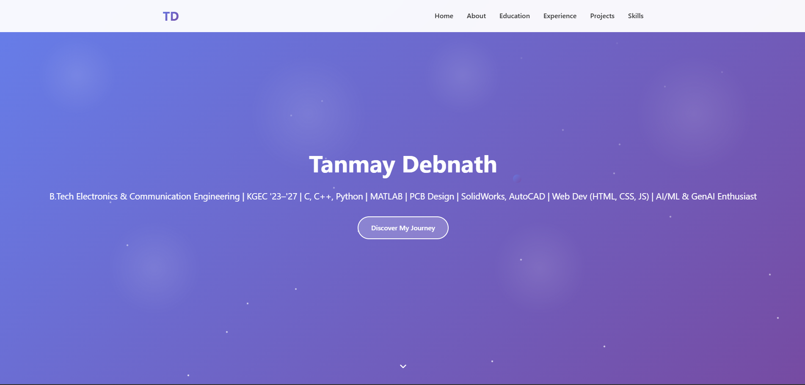
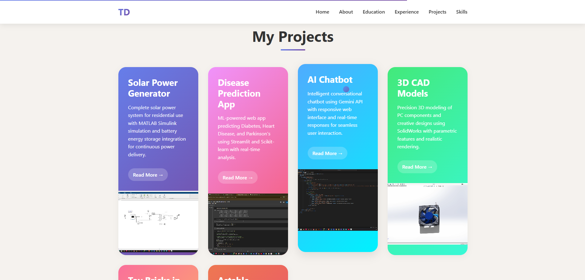
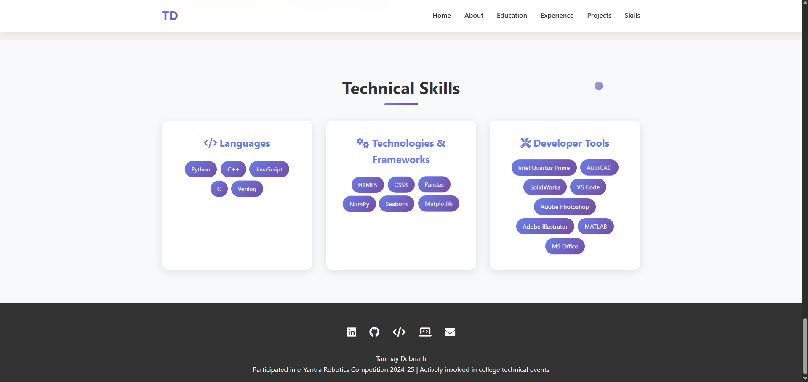

# Tanmay Debnath - Personal Portfolio Website

[](https://github.com/TanmayDebnath1346/Tanmay-portfolio/stargazers)
[](https://github.com/TanmayDebnath1346/Tanmay-portfolio/network/members)
[](https://github.com/TanmayDebnath1346/Tanmay-portfolio/blob/main/LICENSE)
[](https://tanmaydebnath1346.github.io/Tanmay-portfolio/)

  


Welcome to my personal portfolio website! This site showcases my skills, projects, experience, and journey as a developer. Built with modern web technologies, it's fully responsive and designed to highlight my work effectively.

## 🚀 Live Demo

Check out the live version here: [tanmaydebnath1346.github.io/Tanmay-portfolio](https://tanmaydebnath1346.github.io/Tanmay-portfolio/)  


## 📸 Screenshots

| Home Section | Projects Section | Technical Skills |
|--------------|------------------|--------------|
|  |  |  |

*(Add actual screenshots by uploading to `/assets/images/` and updating paths)*

## 🛠️ Technologies Used

- **HTML5** - Structure
- **CSS3** (with Flexbox/Grid) - Styling & Responsiveness
- **JavaScript** - Interactivity & Animations
- **Bootstrap/Tailwind** (if used) - UI Framework
- **GitHub Pages** - Hosting

## 🌟 Features

- **Responsive Design**: Looks great on desktop, tablet, and mobile.
- **Smooth Navigation**: Fixed navbar with scroll effects.
- **Projects Showcase**: Grid layout with filters, modals, and links to live demos/repos.
- **About Me**: Bio, skills progress bars, and timeline.
- **Contact Form**: Functional form with validation (integrate Formspree or EmailJS).
- **Dark Mode Toggle**: Optional theme switcher.
- **SEO Optimized**: Meta tags, Open Graph for social sharing.

## 📂 Project Structure
 Tanmay-portfolio/
- ├── index.html          # Main homepage
- ├── about.html          # About page (if multi-page)
- ├── projects.html       # Projects page
- ├── contact.html        # Contact page
- ├── assets/
- │   ├── css/
- │   │   └── style.css   # Custom styles
- │   ├── js/
- │   │   └── script.js   # Custom scripts
- │   ├── images/         # Photos, icons, screenshots
- │   └── fonts/          # Custom fonts
- ├── README.md           # This file
- └── LICENSE             # MIT License

## 🚀 Getting Started

### Prerequisites
- A modern web browser
- Git installed

### Local Setup
1. Clone the repo:
   ```bash
   git clone https://github.com/TanmayDebnath1346/Tanmay-portfolio.git
2.  Navigate to the directory
    ```bash
    cd Tanmay-portfolio

    
##  Deployment
- Push changes to the main branch.
- Go to Settings > Pages in the repository, select main as the source, and enable GitHub Pages.
- Your site will be live at https://tanmaydebnath1346.github.io/Tanmay-portfolio/.

## 🤝 Contributing
Contributions, issues, and feature requests are welcome! To contribute:

- Open an issue to report bugs or suggest improvements.
- Submit a pull request with your changes.

  
## 📬 Contact

- Name: Tanmay Debnath
- Email: tanmaydebnath1346@gmail.com
- LinkedIn: https://www.linkedin.com/in/tanmay-debnath-ab3ab6290/
- GitHub: https://github.com/TanmayDebnath1346

Project Link: https://github.com/TanmayDebnath1346/Tanmay-portfolio


